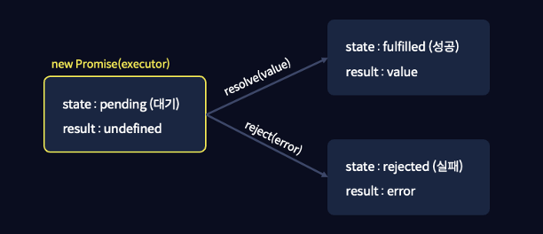

안녕하세요🤗

> 이번시간에는 비동기 작업을 다룰 때 사용되는 Promise 객체에 대해 다뤄보도록 하겠습니다.

# 비동기 처리

저번시간에 배웠던 자바스크립트의 비동기 처리에 대해 다시 한 번 이야기해보겠습니다.

우리는 setTimeout 함수를 이용해 작업을 비동기적으로 처리했었고, setTimeout함수는 작성된 코드와 같이 콜백함수와 ms단위의 지연 시간을 매개변수로 입력받는 함수라고 배웠었습니다.

```js
setTimeout(() => {
    console.log("3초만 기다리세요");
}, 3000);
```

그렇다면, 이번에는 3초후에 전달받은 값에 100을 더한 값이 출력되는 간단한 비동기 함수를 구현해보겠습니다.

add 라는 함수를 생성하고, 특정 값과 콜백함수를 매개변수로 전달 받도록 해주고, add 함수를 호출할 때에도 더할 값과, 결괏값을 출력하는 콜백함수를 인수로 전달하도록 하겠습니다.

그 다음, 이 add 함수의 내부에 setTimeout 을 사용해, 3초의 지연시간을 걸어주고, 콜백함수에 이 매개변수로 받은 value 값에 100을 더한 값을 전달해줍니다.


```js
const add = (value, callback) => {
    setTimeout(() => {
        callback(value + 100);
    }, 3000);
};

console.log("===시작===");

add(120, (res) => {
    console.log(res);
});
```

해당 코드의 실행 결과를 살펴보겠습니다.

실행 후 가장 먼저 console.log 를 통해 ===시작=== 이 출력됩니다.

그 다음, add 함수가 호출되, 숫자 120과 함수를 인수로 전달합니다.

이 add 함수에서는 value 값으로 숫자 120을 받고, callback 으로는 결괏값을 출력하는 함수를 전달받습니다.

이후 setTimeout의 콜백함수에서 120에 100을 더한 값인 220이 3초 후에 출력됩니다.

여기까지 setTimeout을 사용했을 때 코드의 순서가 어떻게 흘러가는지 이해하셨다면, 자바스크립트의 비동기 처리에 대해 완벽하게 이해하신겁니다.

그렇다면, 이번에는 매개변수로 전달받은 숫자에 100을 더하고 출력하는 과정을, 1초마다 3번 수행하는 코드를 작성해보겠습니다.

add라는 함수의 매개변수는 동일하게 작성해주고, 지연시간을 1초로 변경해주겠습니다.

그 다음 전달받은 수에 100을 더하고 출력해야하기 때문에, 우선 add 함수를 호출할 때, 콜백함수에 결괏값을 출력하는 코드를 작성해주도록 하겠습니다.

```js
const add = (value, callback) => {
  setTimeout(() => {
    callback(value + 100);
  }, 1000);
};

add(120, (res) => {
  console.log(res);
});
```

하지만 이 과정을 3번 반복해서 수행해야하기 때문에, 이 인수로 전달한 콜백함수의 내부에서 다시 add 함수를 호출해주겠습니다.

이때, 인수로 전달하는 값으로는 앞에서 100을 더한 결괏값인 res를 넘겨, 같은 숫자에 계속해서 100을 넘겨주겠습니다.

```js
const add = (value, callback) => {
  setTimeout(() => {
    callback(value + 100);
  }, 1000);
};

add(120, (res) => {
  console.log(res);
  add(res, (res) => {
    console.log(res);
  });
});

```

이 과정을 3번 반복해야 하므로, 마지막으로 동일한 작업을 반복해주겠습니다.

```js
const add = (value, callback) => {
    setTimeout(() => {
        callback(value + 100);
    }, 1000);
};

add(120, (res) => {
    console.log(res);
    add(res, (res) => {
        console.log(res);
        add(res, (res) => {
            console.log(res);
        });
    });
});
```

코드를 실행하면, 1초마다 220, 320, 420이 출력되는 것을 볼 수 있습니다.

자바스크립트에서 비동기 작업을 처리 할 때에는, 이렇게 setTimeout 함수와 함께 콜백함수를 사용하게 되는데요, 이렇게 비동기적으로 처리해야하는 작업이 많다면, 가독성이 매우 좋지 않고, 복잡한 코드를 작성해야합니다.

우리는 이렇게 > 모양으로 복잡하게 생긴 코드를 `콜백 지옥` 이라고 부르며, 이러한 콜백 지옥은 `프로미스 객체 (Promise 객체)`를 이용해 해결할 수 있습니다.

# 프로미스 객체

프로미스 객체는 비동기 작업을 더 편리하게 처리할 수 있게 도와주는 자바스크립트의 내장 객체입니다.

생성법 부터 알아보겠습니다.

프로미스 객체는 new 키워드와 생성자를 사용해 생성가능합니다.

```js
const promise = new Promise();
```

프로미스 객체를 만들 때에는 인수로 executor 라는 실행함수를 전달합니다.

```js
const executor = (resolve, reject) => {
    //코드
};
const promise = new Promise(executor);
```

실행함수란 프로미스 생성자에 반드시 들어가야 하는 함수이며, 작업을 비동기로 처리하는 함수입니다.

3초 후에 실행되는 비동기 함수를 프로미스 객체를 이용해 구현해보겠습니다.

executor 실행함수 안에 setTimeout 함수를 작성해 "3초만 기다리세요" 라는 문장을 출력해보도록하겠습니다.

```js
const executor = (resolve, reject) => {
    setTimeout(() => {
        console.log("3초만 기다리세요");
    }, 3000);
};
const promise = new Promise(executor);
```

코드를 실행하면 3초 후에 "3초만 기다리세요" 라는 문장이 출력되는 것을 확인할 수 있습니다.

이렇게 executor 함수는 프로미스 객체를 생성함과 동시에 실행되는 실행함수입니다.

## resolve와 reject

여기서 설명 없이 작성만 하고 그냥 넘어간 부분이 있는데요, 바로 executor 함수의 매개변수인 resolve와 reject 콜백함수 입니다.

resolve와 reject은 자바스크립트에서 자체적으로 제공하는 콜백함수으로, executor는 비동기처리가 성공하면 resolve를, 실패한다면 reject를 호출합니다.

비동기 처리 작업은 항상 성공할 수도, 실패할 수도 있기 때문에 이 resolve와 reject 둘 중 하나는 반드시 호출해야합니다.

### 프로미스 내부 프로퍼티

더 자세한 설명을 위해 프로미스 객체의 내부 프로퍼티들을 살펴보겠습니다.

프로미스 객체는 state, result 이렇게 두 가지의 내부 프로퍼티들을 갖습니다.

프로미스 객체는 맨 처음 대기(pending) 상태와 undefined의 값을 가지고 있다가, executor 가 호출하는 콜백 함수에 따라 state와 result가 변화됩니다.

 

그림에서 볼 수 있듯이, executor가 실행되고, 처음엔 대기 상태에 있다가, resolve가 호출 될 경우 프로미스의 state를 fulfilled(성공)로 변경하고, reject가 호출 될 경우 상태를 rejected(실패)로 변경합니다.

result 값도 마찬가지로, 처음엔 undefined의 값을 갖고있다가 resolve가 호출이 되면 value로, reject가 호출이 되면 error 로 변경됩니다.

이렇게 프로미스 객체의 상태는 resolve와 reject를 통해 변하지만, 한 번 변경된 상태는 더 이상 변하지 않기 때문에, 처리가 끝난 프로미스 객체에 resolve 또는 reject를 호출하면, 무시된다는 것을 주의해야합니다.

## resolve 와 reject 사용하기

resolve와 reject가 호출 될 때 프로미스의 내부 프로퍼디 값들이 어떻게 변화하는지에 대해 배워보았으니, 이번에는 resolve와 reject의 사용법에 대해 배워보겠습니다.

### resolve

3초 후에 "성공" 을 출력하는 비동기 함수를 resolve를 이용해 구현해보겠습니다.

executor 함수에서 비동기 처리된 결과 값을 반환할 때에는, 매개변수로 받은 resolve 콜백함수에 결과값을 전달하면 됩니다.

그리고 이 reslove 콜백함수에 전달된 값은 프로미스 객체의 `then 메서드`를 이용해 사용할 수 있고, then 메서드에는 executor 함수에서 전달한 값이 매개변수로 전달됩니다.

그렇기 때문에 이 매개변수를 console.log를 통해 출력까지 해볼 수 있습니다.

```js
const executor = (resolve, reject) => {
    setTimeout(() => {
        resolve("성공");
    }, 3000);
};

const promise = new Promise(executor);
promise.then((res) => {
    console.log(res);
});
```

작성한 코드를 전체적으로 살펴보도록 하겠습니다.

먼저 프로미스 객체가 생성됨과 동시에 executor 함수가 실행되었고, executor 함수에서는 매개변수로 받은 콜백함수들 중, resolve 함수를 사용해 "성공" 라는 값을 전달했습니다.

이때, 프로미스 객체의 state는 pending 에서 fulfilled 로 변경되고, result는 undefined에서 "성공" 으로 변경됩니다.

그 다음, then 메서드를 통해 프로미스 객체의 result 값을 매개변수로 받아 콘솔에 출력하는 코드입니다.

### reject

그럼 번에는 reject를 이용해 비동기 처리가 실패했다고 가정해보고, reject 함수의 사용법을 알아보겠습니다.

executor 함수에서 reject 콜백함수를 사용해 "실패" 라는 값을 전달해보겠습니다.

```js
const executor = (resolve, reject) => {
    setTimeout(() => {
        reject("실패");
    }, 3000);
};

const promise = new Promise(executor);
promise.then((res) => {
    console.log(res);
});
```

reject 함수가 실행되었기 때문에, 프로미스 객체의 state는 pending 에서 rejected로, result는 undefined 에서 "실패" 로 변경됩니다.

동일하게 then 메서드를 통해 프로미스 객체의 result 값을 콘솔에 출력해봤지만, 이번엔 아무것도 출력 되지 않는 것을 볼 수 있습니다.

then 메서드는 작업이 성공했을 때 사용되는 메서드이고, 이렇게 reject 함수를 사용해, 작업이 실패했을 때 사용하기 위해서는 catch 메서드를 사용해야 합니다.

```js
const executor = (resolve, reject) => {
    setTimeout(() => {
        reject("실패");
    }, 3000);
};

const promise = new Promise(executor);
promise
  .then((res) => {
    console.log(res);
  })
  .catch((error) => {
    console.log(error);
  });
```

이렇게 작업이 실패하게되면, then 메서드는 실행되지 않고, catch 메서드만 실행되어, 콘솔창에 "실패" 라는 값이 전달됩니다.

## 콜백지옥을 해결하는 Promise 객체

프로미스 객체를 생성하고, executor와 프로미스 객체의 내부 프로퍼티들에 대해 배우면서, 프로미스 객체를 활용해 비동기 작업이 성공했을 때와, 실패했을 때 처리하는 방법까지 알아보았습니다.

마지막으로는 우리가 프로미스 객체를 배우기 전에 겪었던 `콜백지옥` 함수를 지금까지 배운 프로미스 객체를 사용해 작성해보겠습니다.

콜백지옥을 설명했던 예시 그대로, 숫자 120 시작으로 값이 420이 될 때 까지 1초에 100씩 더해지는 함수를 구현해보도록 하겠습니다.

동일하게 add 함수를 생성하고, 이번에는 콜백함수를 사용한 비동기 처리가 아닌, 프로미스 객체를 사용하기 때문에, 콜백함수가 필요 없어져 매개변수로는 value 라는 숫자만 받아줍니다.

그 다음 함수의 내부에 프로미스 객체를 생성해주겠습니다.

이번에는 executor 함수를 별도로 작성하지 않고, 바로 콜백함수로 넣어주도록 하겠습니다.

executor 함수는 resolve와 reject 두 가지 콜백 함수를 필요로 하기 때문에 매개변수로 전달해주고, setTimeout을 사용해 비동기 처리를 해주겠습니다.

그 다음, 이 콜백함수 내부에는 num 라는 변수에 value 의 값에 100을 더한 값을 담아주고, 이 value의 값에 100을 3번 더하는 코드를 만들어야 하기 때문에, 120에 100을 3번 더한 값인 420 보다 num 값이 크다면, reject를 사용해 에러를 발생시켜주겠습니다.

그 다음, num 값을 출력해주고, resolve 를 통해 num 값을 결괏값으로 전달해줍니다.

이제 add 함수를 호출해보겠습니다.

호출 할 때에는 위에서 사용했던 120 이라는 동일한 숫자를 인수로 전달하고, then 메서드를 통해 결괏값을 받아, 다시 add 함수에 인수로 결괏값을 전달해줍니다.

```js
const add = (value) => {
  const promise = new Promise((resolve, reject) => {
    setTimeout(() => {
      let num = value + 100;
      if (num > 420) {
        reject("Error");
        return;
      }
      console.log(`값: ${num}`);
      resolve(num);
    }, 1000);
  });
  return promise;
};

add(120).then((res) => {
  add(res)
    .then((res) => {
      add(res).then((res) => {});
    })
    .catch((error) => {
      console.log(error);
    });
});
```

이렇게 작성해본 결과, 코드가 많이 깔끔해지긴 했지만, 여전히 콜백지옥의 모양과 비슷하기 때문에 많은 차이가 있지는 않다고 느끼실 겁니다.

그럼 이번에는 이 then 메서드를 다른 방식으로 사용해보겠습니다.

## 프로미스 체이닝

이번에는 then 메서드의 콜백함수 안에서, add함수를 리턴해주도록하겠습니다.

```js
add(120)
  .then((res) => {
    return add(res);
  })
```

이렇게 add 함수가 반환되게 되면, add 함수의 반환값인 프로미스 객체가 반환되는 것이기 때문에, 다시 한번 then을 사용할 수 있게 됩니다.

```js
const add = (num) => {
  const promise = new Promise((resolve, reject) => {
    setTimeout(() => {
      let value = num + 100;
      if (value > 420) {
        reject("Error");
        return;
      }
      console.log(`값: ${value}`);
      resolve(value);
    }, 1000);
  });
  return promise;
};

add(120)
  .then((res) => {
    return add(res);
  })
  .then((res) => {
    return add(res);
  })
  .catch((error) => {
    console.log(res);
  });
```

이렇게 계속해서 프로미스 객체를 반환하며, then 메서드를 연속으로 사용하는 것을 "프로미스 체이닝" 이라고 부릅니다.

프로미스 체이닝을 사용해 코드를 작성하면, 코드를 아래쪽으로 계속 작성할 수 있기 때문에 훨씬 직관적으로 코드를 해석할 수 있고 코드가 깔끔해지는 것을 볼 수 있습니다.

이번시간에는 이렇게 프로미스 객체에 대해 배우고, 콜백지옥을 해결하는 방법까지 알아보았습니다.

다음시간에는 이 프로미스 객체를 더 쉽게 사용할 수 있는 async/awiat에 대해 배워보도록 하겠습니다.

감사합니다.
