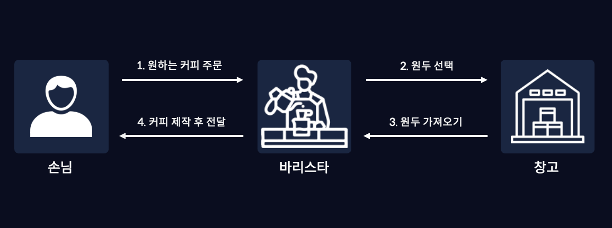
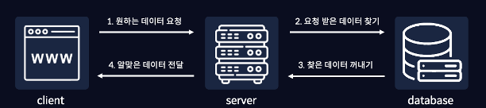
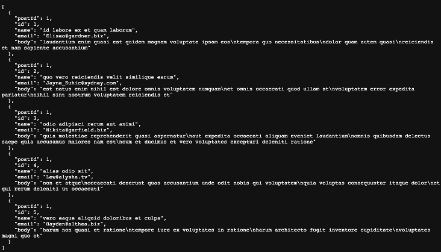
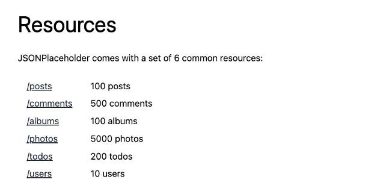
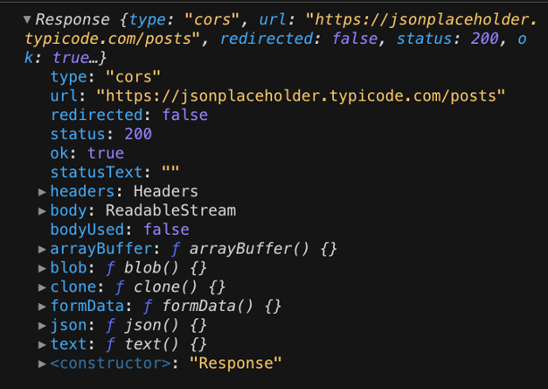

안녕하세요😄

> 이번시간에는 클라이언트와 서버의 통신 과정에 대해 배우고, 지금까지 배웠던 비동기 처리 내용들을 활용해 직접 API를 호출해보겠습니다. 

# API란

인터넷에 API 정의를 검색해보면 API란 Application Programming Interface로, "컴퓨터나 컴퓨터 프로그램 사이의 연결" 이라고 나와있는데요, 

인터페이스가 무엇인지, 그리고 컴퓨터나 컴퓨터 프로그램 사이의 연결이 무엇을 의미하는지 아직 잘 와닿지 않는 것 같습니다.

이렇게 어렵게 설명된 API 정의를 대신해, 아주 쉬운 예시를 통해 API란 무엇인지 자세하게 배워보도록 하겠습니다.

## 클라이언트와 서버의 통신

API에 대해 이해하려면, 먼저 클라이언트와 서버의 데이터 통신 즉, 우리가 웹이나 앱을 이용할 때 어떻게 원하는 데이터를 요청하고 받을 수 있는지를 먼저 이해해야합니다.

### 커피숍과 클라이언트-서버 통신

이러한 과정은 우리가 커피숍에 가서 커피를 주문하고 마시는 과정을 떠올려보면 쉽게 이해할 수 있습니다.

먼저, 우리가 커피숍에서 커피를 주문해 먹는 과정을 떠올려봅시다.

커피숍에서는 우리가 직접 커피숍에 들어가서 원두를 갈고 커피를 만들어 먹지 않고, 바리스타가 직접 알맞은 원두를 골라 커피를 제작합니다.

커피숍에서 커피를 주문하는 자세한 과정을 단계로 나눠 보자면 다음과 같습니다.

 

1. 손님이 바리스타에게 원하는 커피를 주문합니다.
2. 바리스타는 주문받은 커피를 만들기 위해 필요한 원두를 파악하고, 창고에서 원두를 선택합니다.
3. 바리스타는 창고에서 선택한 원두를 가져옵니다.
4. 선택한 원두로 커피를 제작하고, 완성된 커피를 손님에게 전달합니다.

이러한 과정은 우리가 웹이나 앱에서 데이터를 요청하고 전달받는 방식과 비슷합니다.

우리가 커피숍에서 커피를 주문하고 전달받는 과정과 마찬가지로 우리가 웹이나 앱에서 데이터를 요청하고 전달받는 방식을 단계별로 나눠보겠습니다.

 

1. 웹브라우저에서 서버에게 원하는 데이터를 요청합니다.
2. 서버는 데이터베이스에서 요청받은 데이터를 찾습니다.
3. 서버가 데이터베이스에서 찾은 데이터를 꺼내옵니다.
3. 꺼내온 데이터를 서버가 웹브라우저에게 전달합니다.

이 과정에 나오는 웹브라우저(클라이언트)는 손님, 서버는 바리스타, 데이터베이스는 창고 그리고 데이터는 커피 라고 할 수 있습니다.

커피숍에서 원하는 커피를 주문하는 과정과 마찬가지로 클라이언트는 원하는 데이터가 있을 경우, 직접 다른 서버의 데이터베이스에 접근하지 않고 원하는 데이터를 `요청` 합니다.

그 다음, 바리스타가 손님이 주문한 커피를, 창고에서 알맞은 원두를 찾아 제작하듯이 서버 또한 클라이언트가 요청한 데이터를 데이터베이스에서 찾고 꺼냅니다.

마지막으로 바리스타가 완성된 커피를 우리에게 전달하는 것처럼, 서버도 클라이언트가 요청한 데이터를 전달합니다.

정리해보면, 클라이언트와 서버의 통신은 클라이언트가 서버에 데이터를 요청하면, 서버는 데이터베이스에서 요청받은 데이터를 찾고 꺼내와서, 다시 클라이언트에게 알맞은 데이터를 전달하는 과정이라고 할 수 있습니다.

### 그래서 API란?

이렇게 클라이언트와 서버의 통신을 이해하셨다면, 이제 "컴퓨터나 컴퓨터 프로그램 사이의 연결"인 API가 무엇인지 배워보겠습니다.

API는 이렇게 웹브라우저와 같은 클라이언트와 서버 사이의 연결이라고 할 수 있고, 이렇게 서버에 원하는 데이터를 요청하고 전달받는 방법이라고 할 수 있습니다.

그럼 이제 API를 호출하는 방법 즉, 우리가 사용하는 웹 브라우저인 클라이언트에서 서버에게 데이터를 요청하고 전달받는 과정을 자바스크립트로 어떻게 작성해야 하는지 배워보도록하겠습니다.

## API 호출

지금부터는 특정 서버에 데이터를 요청하고 받아보는 API 호출을 직접 실행해보겠습니다.

API 호출을 하기 위해서는 가장 먼저, 우리의 API 호출에 응답을 해줄 수 있는 서버가 필요한데요, 강의 실습을 위해 제작 해둔 별도의 서버가 없기 때문에 여러가지 api 예제들을 무료로 제공해주는 [jsonplaceholder](https://jsonplaceholder.typicode.com/) 라는 서비스를 이용해보도록 하겠습니다.

API 호출을 배우려면 json 형식에 대해 먼저 알아야하는데요, https://jsonplaceholder.typicode.com/posts 에 접속해보면, 많은 `json 형식`의 데이터들을 볼 수 있습니다.

 

Json은 이란 JavaScript Object Notation의 약자로 자바스크립트 객체 표기법 이라는 뜻을 갖고 있고, 자바스크립트에서 객체 형태의 데이터를 가독성 좋게 나타내기 위한 표기법입니다.

이 json은 보통 웹 애플리케이션에서 데이터를 전송할 때 사용되며, 보이는 것과 같이 key value 쌍으로 이루어져있습니다.

다시 돌아와서 https://jsonplaceholder.typicode.com 웹페이지로 이동해보겠습니다.

 

아래로 스크로를 내리다보면 resources라는 화면을 볼 수 있는데, 여기서 우리는 /posts 를 눌러보겠습니다.

여기에 보이는 이 json형식의 데이터들은 https://jsonplaceholder.typicode.com/posts 라는 API의 호출 결과입니다.

이렇게 API는 API 주소(api url)를 통해 호출 할 수 있고, 우리가 이 API를 이용해 호출을 하면 서버는 페이지에 보이는 것과 같은 json 데이터들을 전달해줍니다.

그럼 이제 코드샌드 박스에서 실제로 동일한 API를 호출해보겠습니다.

우리는 jsonplaceholder에서 제공해주는 api 중 하나인, 이전에 우리가 확인했었던 https://jsonplaceholder.typicode.com/posts 를 이용해서 API를 호출해보겠습니다.

자바스크립트에서는 fetch 라는 내장함수를 이용해 API를 호출할 수 있습니다.

fetch 내장함수 안에는 우리가 사용할 API 주소를 넣어줄 수 있습니다.

```js
const response = fetch("https://jsonplaceholder.typicode.com/posts");
console.log(response);
```

response 라는 변수에 API 를 호출 한 결과를 담아 출력해보면, 어디서 많이 본듯 한 Promise {<pending>} 이라는 값이 출력되는 것을 볼 수 있습니다.

저번시간에 우리는, 이렇게 프로미스 객체를 반환하는 함수는 비동기 처리를 하는 함수이고, 이러한 함수는 then 메서드를 사용해 결괏값을 출력할 수 있다고 배웠었습니다.

그럼, 이 비동기 처리 함수의 결괏값을 then 메서드를 통해 출력해보고, catch 메서드를 사용해 에러도 출력해보겠습니다.

```js
const response = fetch("https://jsonplaceholder.typicode.com/posts")
  .then((res) => console.log(res))
  .catch((error) => console.log(error));

console.log(response);
```

코드를 실행하면, 이 fetch 함수는 비동기 함수이기 때문에 가장 아래 작성된 response를 출력하는 코드가 먼저 실행되었고, 이후 프로미스에서 resolve 함수를 통해 전달된 결괏값을, then 메서드에서 매개변수로 받아 API 호출의 결괏값이 출력되는 것을 볼 수 있습니다.

 

API 호출 결과를 살펴보면, 우리가 확인했던 jsonplaceholder 사이트와는 전혀 다른 값들이 출력되었는데요, 그 이유는 우리가 API를 잘못 호출한 것이 아니라, 이렇게 fetch를 통해 API를 호출하면, Response라는 API 성공 객체 그 자체를 반환하기 때문에 이러한 값이 출력되는 것입니다.

그럼 우리가 원하는 데이터들을 전달받기 위해 getData 라는 함수를 생성한 다음, 함수 내부에서 fetch를 통해 API를 호출해보도록 하겠습니다.

앞에서 설명했던 것 처럼 fetch는 프로미스 객체를 반환하는 비동기적으로 처리하는 내장함수 이기 때문에, 지난시간에 배운 async/await을 사용해주도록 하겠습니다.

getData 라는 함수를 생성하고, async 를 작성해줍니다.

그 다음 함수의 내부에서 res 라는 변수에 fetch 함수로 API를 호출해주겠습니다.

```js
const getData = async() => {
  const res = fetch("https://jsonplaceholder.typicode.com/posts");
};

getData();
```

우리가 jsonplaceholder 사이트에서 봤던 것 처럼, 자바스크립트에서 api를 통해 데이터를 요청하면, 보통 json 형식의 문자열을 받게 됩니다.

하지만 이 json 형식은 앞에서 배웠던 것처럼 자바스크립트 객체 표기법으로, 객체 형태의 데이터를 가독성 좋게 나타내기 위한 표기법이기 때문에, 자바스크립트에서 이 json 데이터를 사용하려면 문자열을 파싱해서 객체 형태로 변환해야합니다.

그렇기 때문에 이 fetch 함수의 반환값인 json 형식의 데이터가 담긴 res 변수에 json이라는 메서드를 사용해 이를 객체 형태로 변환해주겠습니다.

이때, 이 fetch 함수는 비동기적으로 처리되기 때문에, 이 API의 호출이 완전히 끝난 이후에, 이 res 변수를 객체로 변환해주기 위해 await을 작성해주도록 하겠습니다.

await 키워드가 작성된 코드의 아래 작성된 코드들은, 해당 함수가 처리 된 이후에 실행된다고 지난시간 배웠었습니다.

```js
const getData = async() => {
  const res = await fetch("https://jsonplaceholder.typicode.com/posts");
  const data = await res.json();
  console.log(data);
};

getData();
```

이렇게 코드를 작성하고, 실행 후 출력 결과를 보면 우리가 jsonplaceholder 페이지에서 봤던 100개의 데이터들이 객체의 형태로 출력되는 것을 볼 수 있습니다.

이렇게 API의 개념과 API 호출 방법을 배워보았습니다. 

API 호출은 필요한 데이터를 전달받기 위해 필요한 데이터를 요청하는 작업입니다.

데이터를 요청할 때에는 우리의 컴퓨터가 아닌, 다른 서버 프로그램에 데이터를 요청하는 경우가 많기 때문에, 네트워크 오류 혹은 인터넷 속도 등의 다양한 이유로 실패할 수 있다는 점을 주의해야합니다.

그렇기 때문에 API 호출처럼, 성공할 수 도, 실패할 수 도 있고 작업이 언제 끝날지 모르는 작업들을 모두 비동기적으로 처리하고 작업이 완료된 이후에 결괏값을 받아볼 수 있도록 해야하고, 항상 오류가 발생할 상황을 대비해서, 에러 처리를 해주어야합니다.

우리가 작성한 코드에서 저번시간에 배웠던 try/catch를 사용해 에러처리를 해주도록 하겠습니다.

작성한 코드를 try와 catch로 묶어주고, fetch 내장함수 내부에 작성된 API 주소를 임의로 변경해보겠습니다.

```js
const getData = async () => {
    try {
        const response = await fetch("https://jsonplaceholder123.typicode.com/posts");
        const data = await response.json();
        console.log(data);
    } catch (error) {
        console.log(`error : ${error}`);
    }
};

getData();
```

try문 내부의 코드들이 먼저 실행되고 오류가 발생해, catch 문을 통해 catch 내부의 코드가 실행되어 에러가 출력되는 것을 확인할 수 있습니다.

이렇게 API 호출을 async와 await을 이용해 비동기적으로 처리한다면 가독성이 좋기 때문에 코드들이 어떤 역할을 하는 코드인지, 코드의 실행순서가 어떻게 되는지 직관적으로 알 수 있고, 에러처리도 쉽게 할 수 있다는 장점이 있습니다.

이번 시간을 끝으로 자바스크립트 응용하기 챕터의 강의를 모두 마쳤습니다.

다음 시간 부터는 우리가 자바스크립트를 사용해 개발 할 웹 페이지와, 자바스크립트로 웹 페이지를 어떻게 개발할 수 있는지에 대해 배워보도록 하겠습니다.

감사합니다.