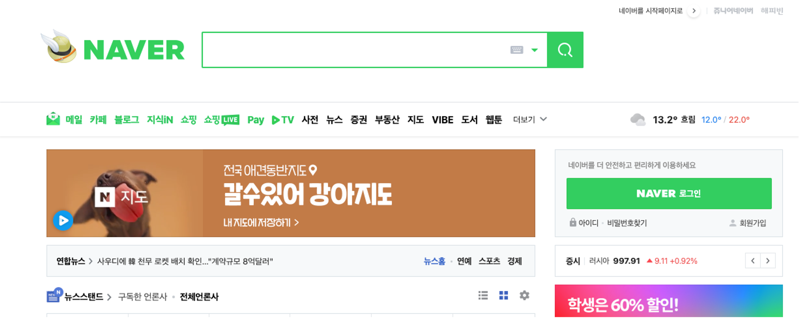

안녕하세요😄

> 이번 시간에는 웹에 대한 기본적인 개념과, DOM에 대해 배워보도록 하겠습니다.

# 웹이란

웹이란 우리 모두가 알고있는 것처럼, 인터넷에 연결된 사용자들이 서로의 정보를 공유할 수 있는 공간을 의미합니다. (출처-위키백과)

이러한 웹에서 HTML로 작성된 페이지를 웹 페이지라고 하고, 이 웹 페이지들이 여러개 모여있는 집합을 웹 사이트라고 부릅니다.

웹 사이트란, google.com 과 같은 주소, url에 접속해서 볼 수 있는 웹 페이지들을 통틀어 말하는 말로, 흔히 말하는 홈페이지라고 할 수 있습니다. 

이렇게 우리가 흔히 볼 수 있는 웹 사이트들은 보통 HTML, CSS, 자바스크립트로 이루어져있습니다.

자바스크립트는 제일 처음 강의에서 "웹 페이지를 동적으로 만들어주기 위해 개발된 프로그래밍 언어" 이고, 웹 요소들에 접근해 수정하고 조작할 수 있다고 배웠었는데요, 그럼 이 HTML과 CSS가 무엇인지 그리고, 자바스크립트는 왜 이들과는 다르게 웹 요소들에 접근할 수 있는 건지 배워보겠습니다.

## HTML과 CSS

HTML은 Hyper Text Markup Language의 약자로, 쉽게 말하면 브라우저에게 웹 페이지의 요소들이 어떻게 구성되어있는지를 알려주는 역할을 하고,

CSS는 Cascading Style Sheets의 약자로, 말 그대로 웹 페이지의 요소들을 꾸며주는 역할을 하는 sheet 입니다.

 

네이버 메인 페이지를 예시로 보면, 이렇게 초록색, 이미지, 아이콘, 폰트 등은 CSS를 통해 설정 가능하고, 검색창, 글자, 로그인 버튼 등의 요소들은 HTML을 통해 생성 가능하며,

로그인 버튼 클릭, 검색하기, 다른 페이지로 이동하기 등의 동적인 기능들은 자바스크립트로 개발 가능합니다.

> HTML 은 웹 요소들을 구성하고, CSS 는 웹 요소들을 꾸며주고, Javascript는 웹 요소들을 생성, 삭제, 변형 합니다.

그럼 이제 자바스크립트는 어떻게 HTML로 작성된 웹 요소에 접근해 웹 페이지를 동적으로 만들고, 어떻게 웹 요소들을 변형시킬 수 있는지 알아보겠습니다.

이를 설명하기 위해서는 DOM(Document Object Model) 이라는 객체에 대한 이해가 필요한데요, DOM이란 무엇인지 살펴보도록 하겠습니다.

# DOM란

DOM이란 Document Object Model 문서 객체 모델로, HTML로 작성된 여러 요소들에 자바스크립트가 접근할 수 있도록 브라우저가 변환시킨 객체입니다.

쉽게 말해 브라우저가 우리가 작성한 HTML을 자바스크립트가 이해하고 조작할 수 있게 "객체로 변환" 한 것 입니다.

웹 브라우저는 이 HTML 문서를 불러 온 다음 이를 오른쪽과 같이 상하 관계를 한 눈에 볼 수 있는 트리 구조로 나타내는데, 이를 DOM Tree라고 부릅니다.

DOM Tree에서 이 아이템 하나 하나를 노드(Node)라고 부르며, 이 노드들은 전부 하나의 객체로 이루어져 있고, 웹 브라우저는 이 DOM Tree를 통해 웹 요소들을 웹 페이지에 나타낼 수 있습니다.

이러한 DOM은 자바스크립트가 자신에게 접근해 DOM을 조작하고 수정할 수 있는 방법을 제공합니다.

이 방법을 DOM API 라고 부르며, 자바스크립트는 DOM이 제공하는 DOM API를 통해 웹 요소들을 수정하고 조작할 수 있습니다.

이번 시간에는 웹에 대한 개념과 DOM에 대해 배워보았습니다.

다음 시간에는 이 DOM API를 사용해 웹 요소들에 접근하는 방법과 웹 요소들을 수정하는 방법에 대해 배워보도록 하겠습니다.

감사합니다.